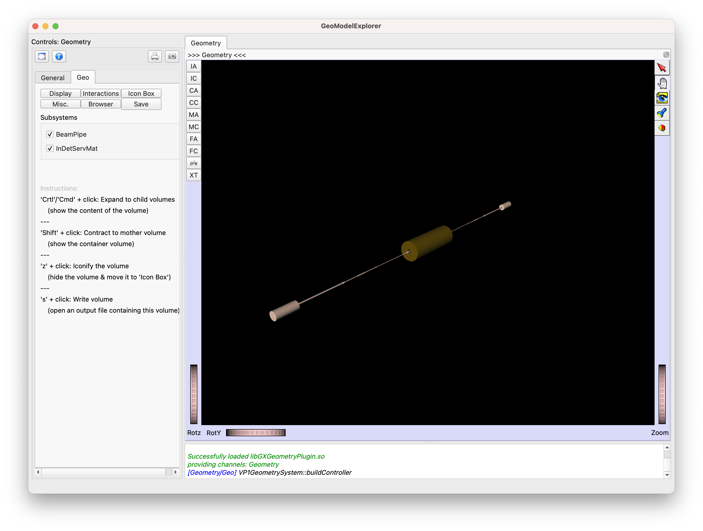

# DumpGeo - Dump the ATLAS GeoModel to a local file

 * [Intro](#intro) 
 * [Setup](#build)
 * [Run](#run)
 * [Documentation](#documentation)

## Intro

`DumpGeo` is an Athena algorithm inheriting from the class AthAlgorithm. Internally, it calls the package `GeoExporter` to dump the GeoModel tree resulting from any Geometry TAGs into a local SQLite file.

You can run these intructions on any `lxplus`-like machine (Alma9 or CC7) where the Athena framework is installed, or on macOS with Athena running inside a [a Lima container/light VM](https://atlas-software.docs.cern.ch/athena/containers/lima/).


## Setup 

You should setup Athena, as usual; for example you can setup the latest build of the `24.0` release:

```bash
setupATLAS
asetup Athena,24.0,latest
```

## Run

`DumpGeo` has been migrated to the new Athena Component Accumulator (CA). A new `DumpGeoConfig.py` Python script configures the Athena algorithm.  

`DumpGeo` can be used both as a shell command or as an Athena jobOption, in command-line or embedded within your own jobOption.

### Basic use - Run as a terminal command

After having set Athena, at the prompt, run the command:


```sh
python -m DumpGeo.DumpGeoConfig
```

this will dump the default geometry tag (the Run3 default tag `ATLAS-R3S-2021-03-02-00`, at the time of writing) into a local file named `geometry-ATLAS-R3S-2021-03-02-00.db`. The fine names reflects the geometry tag that has been dumped.

Optionally, you can specify which geometry tag to be dumped by using the `-detDescr` option; for example:

```sh
python -m DumpGeo.DumpGeoConfig --detdescr=ATLAS-R2-2016-01-00-01
```

After issueing the command, a file named `geometry-ATLAS-R2-2016-01-00-01.db` will be created in the run folder.


### Run it as an Athena jobOption

You can also run `dump-geo` as an Athena jobOption. For example:

```bash
athena DumpGeo/dump-geo.py -c "DetDescrVersion='ATLAS-R3-2021-01-00-00‘"
```

You can even embed it into your own workflow, within your own jobOption.


## Options

### Overwrite the Output File

By default, DumpGeo exits with an error when an output file with the same name is found.

You can force to overwrite the output file with the `--forceOverwrite` or `-f` CLI options:

```sh
python -m DumpGeo.DumpGeoConfig -f
```

### Filter DetectorManagers

The CLI option `--filterDetManagers` lets you filter over DetectorManagers.

DetectorManagers are “containers” for subsystems. The class [GeoVDetectorManager](https://gitlab.cern.ch/GeoModelDev/GeoModel/-/blob/main/GeoModelCore/GeoModelKernel/GeoModelKernel/GeoVDetectorManager.h?ref_type=heads) holds all the TreeTops (the top volumes) of a subsystem together.

By using the `--filterDetManagers` CLI option, you can dump the TreeTops belonging to a single DetectorManager:

```sh
python -m DumpGeo.DumpGeoConfig --filterDetManagers="InDetServMat"
```

Or you can dump all TreeTops from multiple managers, passing a comma-separated list:

```sh
python -m DumpGeo.DumpGeoConfig --filterDetManagers="BeamPipe,InDetServMat"
```

The output file will reflect the content of the GeoModel tree:

```sh
geometry-ATLAS-R3S-2021-03-02-00-BeamPipe-InDetServMat.db
```

When dumping the content of a DetectorManager, DumpGeo picks the TreeTop volumes and gets their default Transform (no alignments). 

It then it adds to the output “world” volume a GeoNameTag with the name of the DetectorManager, and then it adds the TreeTop volumes to it with their Transforms ahead of them.

```
World
|
|-- GeoNameTag("BeamPipe")
|
|-- GeoTransform -- TT1
|-- GeoVPhysVol -- TT1
|
|-- GeoTransform -- TT2
|-- GeoVPhysVol -- TT2
|
|-- GeoTransform -- TT3
|-- GeoVPhysVol -- TT3
```

In that way, we get meaningful, comprehensive checkboxes when visualizing the output tree from the SQLite file in [GMEX](https://gitlab.cern.ch/GeoModelDev/GeoModel/-/tree/master/GeoModelVisualization) ([GeoModelExplorer](https://gitlab.cern.ch/GeoModelDev/GeoModel/-/tree/master/GeoModelVisualization))




### Additional Options

You can use all the common Athena flags to steer the dump mechanism. 

With the new CA configuration, you can use the `--help` option to get the list of all available options. 

```bash
$ python -m DumpGeo.DumpGeoConfig —help
```


As soon as we add options to `DumpGeo`, you will get the new ones listed at the bottom of the “help” output, after the common Athena options

```sh
$ python -m DumpGeo.DumpGeoConfig —help

[...Athena options...]

--detDescr TAG                           The ATLAS geometry tag you want to dump (a convenience alias for the Athena flag 'GeoModel.AtlasVersion=TAG') (default: ATLAS-R3S-2021-03-02-00)

--filterDetManagers FILTERDETMANAGERS    Only output the GeoModel Detector Managers specified in the FILTER list; input is a comma-separated list (default: None)

-f, --forceOverwrite                     Force to overwrite an existing SQLite output file with the same name, if any (default: False)
```


## Documentation

You can get more information about the GeoModel tree and the content of the output SQLite file on the GeoModel documentation website: https://cern.ch/geomodel

 

