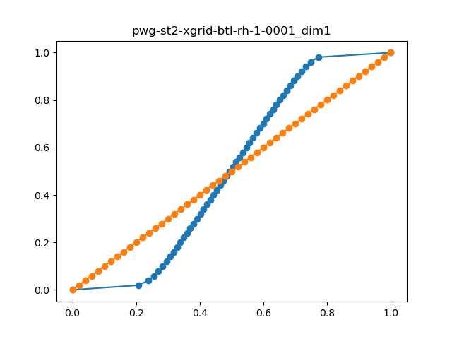
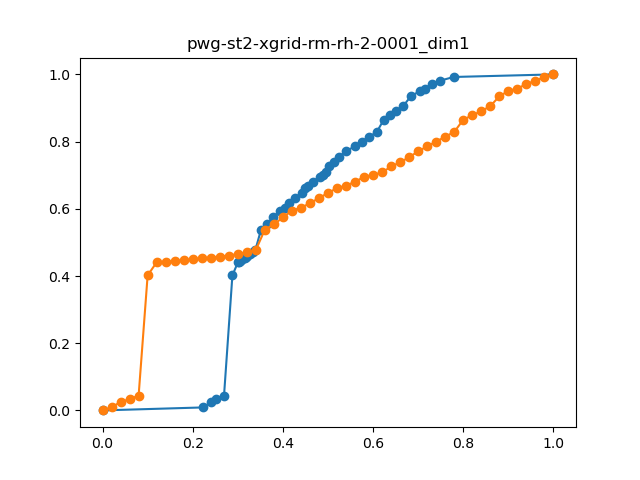
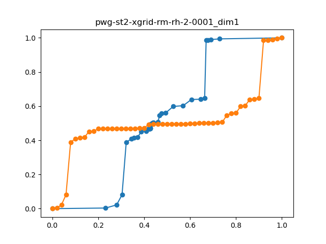

# Process-specific information for `bb4l-dl` production

Information regarding the event generation using the `bb4l-dl` process is collected in this document.
The POWHEG-BOX-RES process uses a modified version of the POWHEG-BOX-RES core source code and 
is currently only available as beta-version under [tjezo/powheg-box-res-bb4l-sl-beta](https://gitlab.cern.ch/tjezo/powheg-box-res-bb4l-sl-beta/-/tree/master).

## Integration grid creation
The bb4l integration grids have been created with a stand-alone compilation of the `pwhg_main` executable (e.g. not 
using `PowhegControl`). This was needed in order to run the stages 1-3 on multiple nodes. While using the athena framework only a single node can be utilized. 

### powheg-box-res-bb4l-sl-beta version and changes 

The powheg-box-res-bb4l-sl-beta with commit [dd2555bb125830a2cd6af044bb64dadb5309ac79](https://gitlab.cern.ch/tjezo/powheg-box-res-bb4l-sl-beta/-/commit/dd2555bb125830a2cd6af044bb64dadb5309ac79) was used. 
Two small changes were applied in order to compile and run the `pwhg_main` executable in the beta-version:

* Increase `maxnum` from `maxnum=150` to `maxnum=500` in `pwhg_pwin.h`. This is the maximum number of powheg.input parameters and needs to be increased to use the automatically generated powheg.input from PowhegControl

* Add `-fallow-argument-mismatch` in gfortran flags in `Makefile`, such that 
`F77=gfortran -fno-automatic -ffixed-line-length-none -J$(OBJ) -I$(OBJ) -fbounds-check -fallow-argument-mismatch`


To compile set up with 

```
source /cvmfs/sft.cern.ch/lcg/views/LCG_105a/x86_64-el9-gcc13-opt/setup.sh
OL_PROCLIB_PATH=""
OpenLoopsPath=""
```

Then `cd` into `b_bbar_4l` directory and `make`.

Copy the files [`runparallel-mpi-st1-xg1.f`](./bblvlv-beta/runparallel-mpi-st1-xg1.f), [`runparallel-mpi-st1-xg2.f`](./bblvlv-beta/runparallel-mpi-st1-xg2.f), [`runparallel-mpi-st2.f`](./bblvlv-beta/runparallel-mpi-st2.f) and 
[`runparallel-mpi-st3.f`](./bblvlv-beta/runparallel-mpi-st3.f) into the `b_bbar_4l/run-example` directory.
Then compile in the `b_bbar_4l/run-example` with 

```
mpif90 runparallel-mpi-<X>.f -o runparallel-mpi-<X>
```

### Generating the integration grids

For the `pwhg_main` run, you need the following files:
* [`powheg.input`](./bblvlv-beta/powheg.input)
* [`pwgseeds.dat`](./bblvlv-beta/pwgseeds.dat)
* [`slurmjob.sh`](./bblvlv-beta/slurmjob.sh)


and the output of the previous stages, in case you are not running stage 1, xgriditeration 1.
These files are the input files used for the nominal `bb4l-dl` integration grid generation.
The `pwgseeds.dat` file needs to contain as many seeds as the number of cores you are running on.

We look at the integration grid parameters of the `powheg.input`, which contains the values used on each core:

```
ncall1 40000                           ! [ATLAS default: 120000] number of calls for initializing the integration grid
ncall1rm 80000                             ! [ATLAS default: -1] number of calls for initializing the integration grid for the remant. [<0:use ncall1]
ncall2 100000                           ! [ATLAS default: 180000] number of calls for computing the integral and finding upper bound
nubound 50000                          ! [ATLAS default: 100000] number of calls to setup upper bounds for radiation
```

This is run on 1280 cores, as can be seen in `slurmjob.sh`. So in total, for the final integration grid we have `ncallX`*1280.

In order to check for bad seeds after stage 1 and stage 2 (of which the output will be ignored in the next stage), the Powheg keywords 
```
check_bad_st2 1
check_bad_st1 1
```
have been set.

Follow these steps for the creation of the integration grid on a MPI capable cluster using slurm scheduler:

* Run stage 1, xg1: modify the `slurmjob.sh` script, such that `runparallel-mpi-st1-xg1` is called
* After stage 1, xg1: Remove output of any unfinished seeds (empty `pwg-*-xg1-stat.dat`)
* Run stage 1, xg2: modify the `slurmjob.sh` script, such that `runparallel-mpi-st1-xg2` is called
* After stage 1, xg2: Remove output of any unfinished seeds (empty `pwg-*-xg2-stat.dat`)
* Run stage 2: modify the `slurmjob.sh` script, such that `runparallel-mpi-st2` is called
* During stage 2: The grids created in stage 1 are merged in stage 2. After the merging is done, you can check the output to investigate the quality of the integration grids (see next section) and if the `ncall1` parameters are sufficiently high.
* After stage 2: check if you find a log file of stage 2 (`run-st2-*.log`) which has a OpenLoops `clean_mom` warning, if yes: remove this file and any unfinished seeds (check [`get_clean_st2_run.sh`](./bblvlv-beta/get_clean_st2_runs.sh) script for this)
* Run stage 3: modify the `slurmjob.sh` script, such that `runparallel-mpi-st3` is called
* After stage 3: remove any unfinished seeds and create reduced integration grids (since taring up all output files would lead to a very large tarball and not all files are needed) as done e.g. in [`cp-files-for-reduced-intgrid.sh`](./bblvlv-beta/cp-files-for-reduced-intgrid.sh)

Additional note:
I noticed that for some numerical values of the seeds saved in `pwgseeds.dat`, no `pwg-*-stat.dat` are created at the beginning of the slurm run (these are usually created at the beginning of the run as empty files) and the corresponding jobs did not finish (probably because they could not write their output to the non-existing file?). Just changing the numerical value of the seeds, the problem was fixed. It is unclear to me where this is coming from (it was a reproducible problem, but easily fixed). The pwgseeds.dat file uploaded here does not have this issue. You can check this in the beginning of the run using an adapated version (adapted to the stage you are currently running) of [check-for-missing-files.sh](./bblvlv-beta/check-for-missing-files.sh).

### Checking the integration grids

Two scripts are provided to check the quality of the `pwhg_main` output in different stages:

#### 1. Checking the integration grids (during stage 2)

You can use the [plot-intgrid.py](./bblvlv-beta/plot-intgrid.py) script to plot the `pwg-st2-xgrid-(btl/rm)-rh-(1/2/3)-0001.top` files. Like this, you get plots for the btilde and remnant grids for the $t\bar{t}$, $tW\bar{b}$ and $\bar{t}Wb$ resonance histories for each "free" dimension. The orange line plotted with this python script should be linear. As can be seen for the plots below, this is the case for the (btilde) $t\bar{t}$ resonance history (`rh=1`), but not for the remnant $tWb$ resonance histories (btilde integration grids are fine also for $tWb$). The `ncall1rm` parameter was increased w.r.t. `ncall1` parameter due to this observation, but still with this increase the plots below were obtained. It was discussed with Tomas Jezo, that since the cross section uncertainty is very low (see below), this should be ok. 






Using `ncall1 = ncall1rm = 40000` per core, the corresponding plot of `pwg-st2-xgrid-rm-rh-1-0001_dim1` is:  



#### 2. Checking the cross section uncertainty (after stage 2)

After the stage 2 is completed, you can check with the `pwg-*-st2-stat.dat` files how large your cross section uncertainty is. With the python script [add-xsec-uncert-quadrature-N.py](./bblvlv-beta/add-xsec-uncert-quadrature-N.py), you can check further how this depends on the number `N` of randomly included files (adjust the `N_values` according to the number of seeds you used and the intervals you want to check). The selection of `N` random files is repeated 30 times and all results are plotted, as well as the upper bound (using the `N` files with highest cross section uncertainty) and lower bound (using the `N` files with lowest cross section uncertainty). For further details, you can check the script. 
Inspecting the output plot of this script in [this link](https://indico.cern.ch/event/1470750/#2-bb4ell-integration-grid-cros), we see that a few files increase the cross section uncertainty significantly. It was discussed with Tomas Jezo, that it is not clear if removing these files would bias the result, so all files are kept. 
Since the cross section uncertainty is approximately low enough (0.03%) with all included files following the rough estimate of needed cross section uncertainty of $\sqrt{N}/N$ ( $N=100$ M $\rightarrow < 0.01 \%$ ), this is not problem for the event generation.
