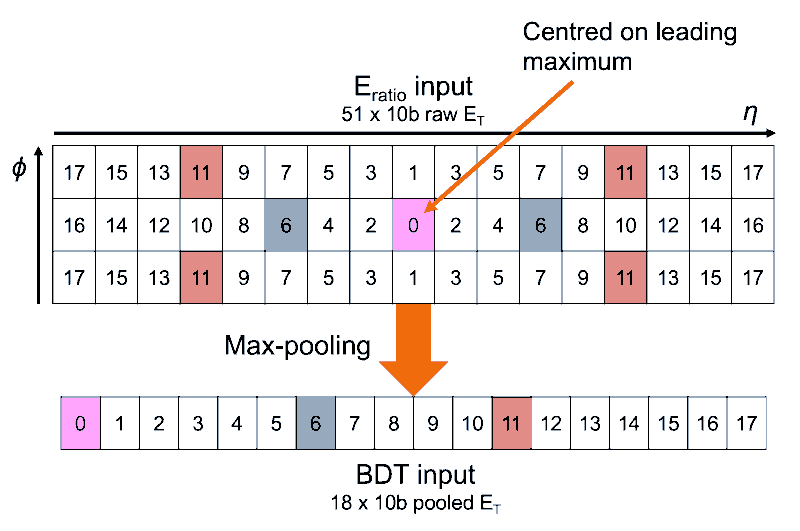

Egamma1 Boosted Decision Tree algorithm for GlobalSimulation
===

This holds the source code for simulation of the eGamma1BDT algorithms for the GlobalSimulation
There is also a version of the Eratio that has been used to compare to the BDT. It will be depricated when the official version arrived in ../Eratio

eGamma1BDT AlgTool
---

This AlTool simulates the Boosted Decision Tree eGamma1 algorithm.
It reads in a collection of eEmNbhoodTOBs. It converts these 51 cell neighbourhoods into a vector of length 18 by taking the MaxPooling:

It then digitizes the energies (this may no longer be necessary) and stores them as ap_int<10> (10bit integers). Each vector is then passed to the eGamma1BDT which calculates a score for the event. eGamma1BDT has been trained offline on signal like and background like inputs. Its resultant BDT has then been quantised to reduce its size. The exact C++ code produced (later converted to VHDL) is stored in the Egamma1BDTfolder here.
This score is then converted to and 8 bit output where 0x00 represents a high confidence that this is a pion->GammaGamma neighbourhood and 0xFF is a high confidence that this is an e/gamma neighbourhood.
This score is then stored in an eEmEg1BDTTOB, and written out to a histogram.

eRatio AlgTool (To be depricated)
---

This AlTool simulates the baseline eRatio eGamma1 algorithm.
It reads in a collection of eEmNbhoodTOBs. It converts these neighbourhoods into three vectors representing the three phi rows in the neighbourhood.
It then digitizes the energies (this may no longer be necessary). Each neighbourhood is then scanned to find the second peak along six seaparate paths (this assumes that the central element is the heighest energy cell).
The six paths are:

Central phi row, down in eta
Central phi row, up in eta
Top phi row, down in eta
Top phi row, up in eta
Bottom phi row, down in eta
Bottom phi row, up in eta

THe maximum second peak is then used to calculate the eRatio for this event and the result is stored to histograms (currently not written to storegate).