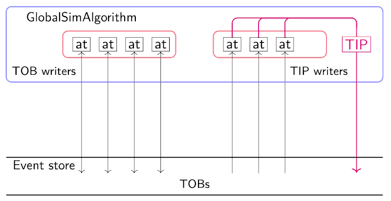

GlobalSimulation main algorithm
===

This holds the source code for simulation for the whole Global board

GlobalSimulationAlg
---

The GlobalSimulation runs from a single AthenaAlg tool which simulated an entire Global Event processor (GEP) board to a bitwise accuracy.
The algorithm calls multiple AlgTools which either injest incoming information (cells, FEX TOBs, muon candidates), proccess and write out TOBs, (TOB writers) or read in collections of TOBs, make apply hypotheses to those TOBs and write out TIP word bits. The main GlobalSimAlgorithm collects these TIP word bits and arranges them into the final TIP word written to StoreGate.
Currently the TOBs passed within the algorithm are transient and cannot be stored permanently.