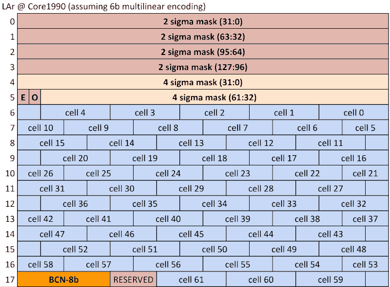
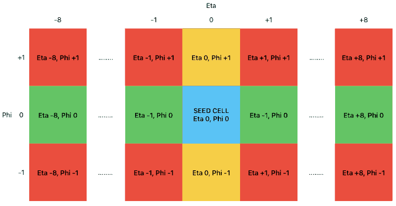

Liquid Argon Cell pre-Preparation algorithms
===

This holds the source code for simulation of the Liquid Argon cell pre-preparation algorithms

LArCellPreparation Algorithm
---

This Algorithm simulates the energy encoding of all LAr cells for Global and simulated the truncation of cells from overflowing FEB2s. The hardware-accurate cells are then stored in a GlobalLArCellContainer object within StoreGate.
This algorithm can configure the number of bits for each cells energy, the lowest significant bit and the gain factor of the multilinear encoding.
The default configuration uses 6-bits per cell. Each  FEB2 is attached to 128 inidividual LAr Cells. It has a 576b word to write out this information to the Global system. This word is arranged (for the default 6b encoding)

- 128bits as a 2-sigma mask defining which bits have energies 2-sigma above the measured noise level. Only 62 cells can be set as over 2-sigma. If more are, they are dropped. The order is strictly geometric at the moment.
- 62bits as a 4-sigma mask stating which of the 62 2-sigma cells is over 4-sigma
- 496bits to read out the 6-bits per cell energies

If a different number of bits are used to define the cell's energies then fewer cells can be read out overall.

- 6bits -> 62 cells
- 7bits -> 54 cells
- 8bits -> 48 cells
- 9bits -> 43 cells
- 10bits -> 39 cells

Cell collections downstream of this algorithm therefore have: Restricted energy encoding, only >2sigma cells and potentially curtailed if more than the maximum need to be written out.

LArCellMux Algorithm
---
This Algorithm simulates both the input bitsream which would be received by the MUX from the LASP based on the input GlobalLArCellContainer, as well as the output bitsream which each MUX would send to the GEPs. All bitstreams are stored as textfiles in the running directory

GlobalCellTower Algortihms
---
 This algorithm simulates the cell towers for the Global Trigger. Input is taken only from LAr cells contained in the GlobalLArCellContainer. Tile cells are not included for now. Cells are placed in towers based on their eta and phi positions and written out as a GenericTOB.

Egamma1_OnlineMapNbhood Algorithm
---
This Algorithm finds and outputs GlobalLArCells in the neighbourhood of eFEX RoIs. These neighhoods are used to run various Egamma1 Algorithms in GlobalSim. This method uses the Athena offline calo map to form the neighbourhood. It is seeded from the GlobalLArCells and  constructs an LArStripNeighborhood.

A neighourhood is constructed from StripData objects constructed from GlobalLArCells (strips) in the vicinity of an EM RoI the following manner:
The strip seed cell in the vicinity of the RoI is identified. An initial neighbourhood of strips centered on the seed is formed. The maximum energy cell within this window is then found. A final neighbourhood is then centered on this cell.

In more detail:
The RoI eta/phi coordinate (a supercell coordinate) is used to identify the seed cell in the strips (EM1) to form the window. This is done by forminga box in eta/phi space for each cell (using the cells known size and centre) and asking if the RoI's eta/phi position falls in it.
As the granularity of the strips changes through the detector the search occurs in differing numbers of strips for each RoI tower range (the crack 1.37-152 is currently not dealth with).
There are (8,6,4,1) strips per RoI supercell. First, the inner eta central strip is searched for first, e.g. +eta 4/8 or -eta 6/8. This lookup is done from a map of cells position to HashIDs formed in the LArCellPreparationAlg. If a cell is found in the collection its ID is returned. If no cell is found then the search continues inwards, then finally outwards in eta.

A 17x3 eta/phi window is then formed around this seed cell. First the seed cell is found from a map of CellID->GlobalLArCells. Then the +-8 cells in eta are found using the m_larem_id->get_neighbours function. If a cell isn't present in the collection a dummy with the correct cellID is added to the list. If the window is at the edge of the detector a dummy with cellID 999999 is added, to allow for full sized windows at the edge. Once the central row has been filled, the process is repeated to fill the phi rows above and below.

Once an initial window has been formed the maximum energy cell in this window is found. If the cell maxima for two rows are equal, then the central row is taken.

This maximum energy cell is then used to repeat the first window finding step to find the final neighbourhood for this eFeXRoI, and an eEmNbhoodTOB is added to the list.

Egamma1_LArStrip_Fex and RowAware Algorithms (Depricated)
---
These are older neighbourhood finding algorithms which only work in the barrel region

EMBE1Cells AlgTool (depricated)
---

This AlTool selects and returns the cells from the EMB1 and EME1 layers. It is superceeded by the FEB2 simulation.