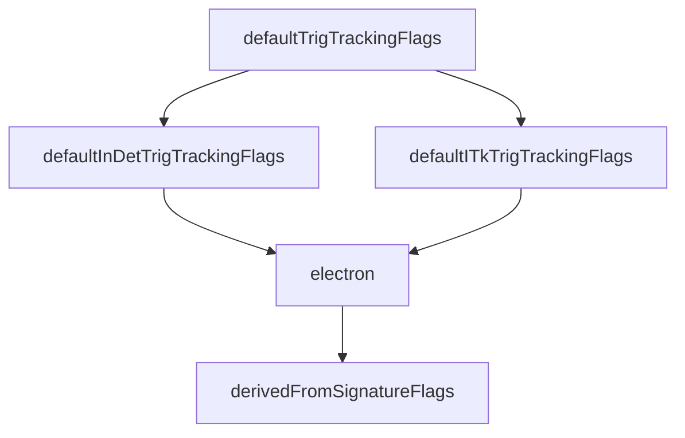

# Overview

The modules in this directory provide trigger configurations of track
reconstruction in the inner detector (InDet and ITk) to be included in
trigger chains. They construct track reconstruction sequences which
can be custom for a given chain and signature and which allow
signature-specific settings of reconstruction algorithms and tools.

Inner Detector tracking consists of the algorithms, and their tools,
that perform data preparation (bytestream conversions, clustering and
space-point formation), Fast Tracking (seed-making, track-following
and track fitting), Precision Tracking (ambiguity solving, track
extension, track fitting) and primary vertex reconstruction. In most
trigger chains, Precision Tracking starts from the tracks found by
Fast Tracking. The reconstruction can be configured to run the full
set of offline algorithms (rather than FastTrackFinder for pattern
recognition) to find tracks.

# User interface

The menu code can use functions provided in
[TrigInDetConfig](TrigInDetConfig.py) which cover most common case of
Fast Tracking using TrigFastTrackFinder, Precision Tracking and
Vertexing in trigInDetFastTrackingCfg, trigInDetPrecisionTrackingCfg,
trigInDetVertexingCfg respectively or use the class
InnerTrackingTrigSequence for special cases directly.


# Configuration

The configuration can be adjusted by a signature specific category of
AthConfigFlags. They are created by signatureTrigTrackingFlags from
[BuildSignatureFlags](BuildSignatureFlags.py). The file includes
signature functionsfor example

```python
electron(flags: AthConfigFlags, instanceName: str, recoMode: str) -> AthConfigFlags:
```

which can be used to set signature-specific flags or values on top of
default settings. The set-up chain calling sequence is



Finally addGlobalFlags is used to add trigger flags common for all signature instances.


A flag can be modified at run time using
```Trigger.InDetTracking.electron.pTmin=3.``` on the athena command line for
example. Signature category flags have to be copied onto
```Tracking.ActiveConfig``` by

```python
newflags = flags.cloneAndReplace('Tracking.ActiveConfig', 'Trigger.InDetTracking.electron',  
                                              keepOriginal = True)
```					      
before the actual configuration of the tracking tools and algorithms is started using the functions from
[InDetConfig](https://gitlab.cern.ch/atlas/athena/-/blob/main/InnerDetector/InDetConfig) and
[TrkConfig](https://gitlab.cern.ch/atlas/athena/-/blob/main/Tracking/TrkConfig).


Last updated 2024/04/04 @jmasik


