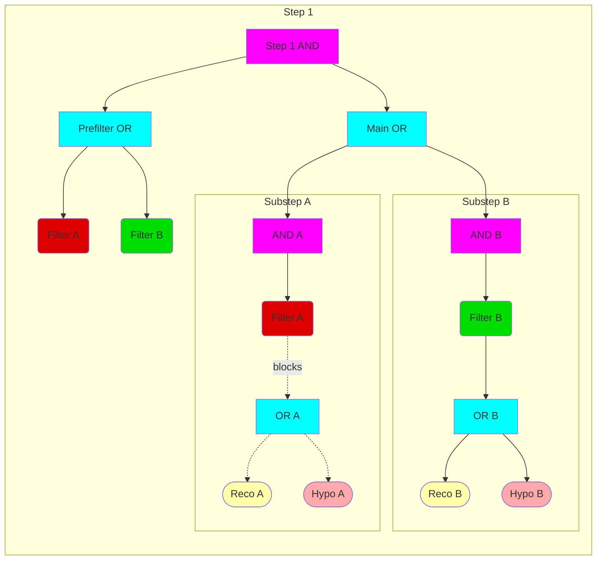
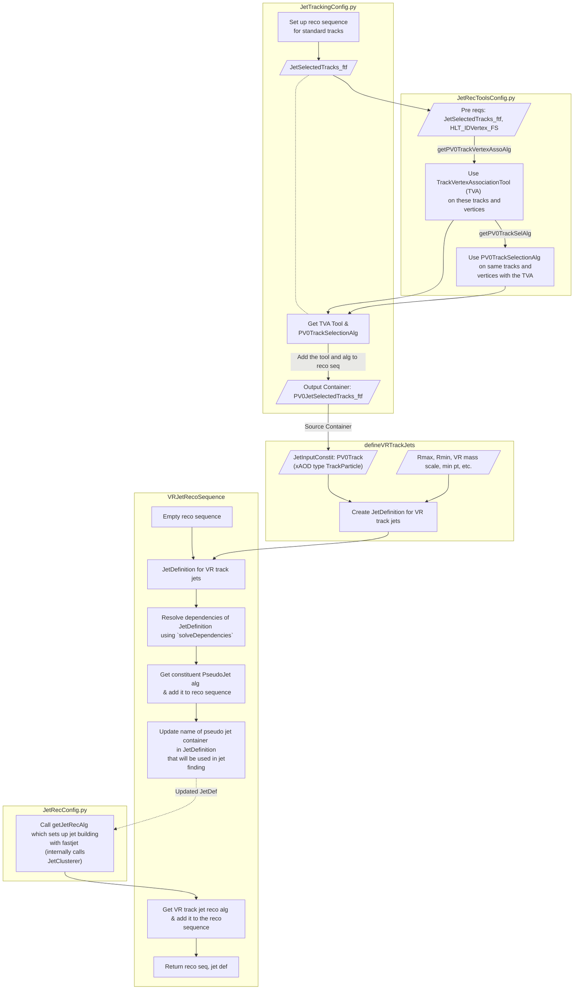

Overview of HLT jet reco configuration modules
=====

Note on configuration caching

There are two sets of configuration caching used in the HLT reconstruction:
1. `@AccumulatorCache` optimises the retrieval of components from `ComponentAccumulator` generating functions, storing a copy of the output from a function call and indexing it by the input arguments. If the same function is called with identical arguments, the cached result is returned.
2. Deferred configuration of the chain step sequences: Where you see `functools.partial()` calls, these indicate that the `MenuSequenceCA` generation is set up as a function call with predefined arguments, but not executed until the Control Flow stage of HLT menu generation. This may be adjusted later in `JetChainConfiguration.py` to use the common `ChainConfigurationBase.getStep()` function.

To facilitate (2) above, we first generate jet reconstruction data dependencies, i.e. the set of jet collections needed for a particular step, which can be communicated to other steps that share this information. Then the list of collections is used to configure all reconstruction and hypo algorithms.

Note on sequence types

The trigger algorithm sequencing is controlled by sequences and filter algorithms. For a more detailed description of how this functions, see e.g. [these slides](https://cds.cern.ch/record/2642559?ln=en).

Essentially, two types of sequence are used:
* parOR: executes all children in parallel and returns the result of an OR over these as its filter decision -- used for reco algorithms
* seqAND: executes all children in sequence and returns the result of an AND over these as its filter decision -- used to activate/deactivate subsequences.
An algorithm may be a child of multiple sequences, but will only execute once.

These are used as depicted in the diagram below. Each step is built with an OR that executes all filters for the step (e.g. these could be electron & muon legs of an e/mu chain). The filters return a pass/fail decision based on preceding hypos. Then the main OR attempts to execute all substeps in parallel. The same filter algorithms are placed in ANDs within each substep, so they block execution if the filter criterion failed (Filter A). Results from the hypos are passed to the next step.

This scheduling is basically handled by menu construction. As a rule of thumb, we use a `seqAND` as the basis for every `MenuSequence`, and `parOR` for all reconstruction sequences.

 Flowchart for VR track jet reconstruction

Variable Radius (VR) track jets are useful in b-tagging of large-R jets. A large-R jet can be b-tagged by performing b-tagging on the VR track jets associated with it. The association method that is commonly used is ghost association.

The flowchart that follows details the steps in VR track jet reconstruction. The logic behind the steps is as follows: In order to reconstruct a jet, we need a `JetDefinition`. The JetDefinition requires an input constituent, which in this case would be the primary vertex tracks. So we need to perform track selection to get the required tracks. Using these tracks we create a VR track jet JetDefinition, which is then used to create VR track jet reconstruction sequence.

[GenerateJetChainDefs](../GenerateJetChainDefs.py)
-----

Called by the menu code in [`TriggerMenuMT/python/HLT/Config/GenerateMenuMT.py`](../../Config/GenerateMenuMT.py) to translate the HLT chain item into a concrete algorithm sequence.

The menu code creates a chain dictionary from the chain name, of which the jet parts are given to `GenerateJetChainDefs.generateChainConfigs` to be interpreted by `JetChainConfiguration`.

[JetChainConfiguration](../JetChainConfiguration.py)
-----

Defines the `JetChainConfiguration` object responsible for interpreting the chain dictionary and building a `Chain` object that is returned to the menu. `JetChainConfiguration` extends the [`ChainConfigurationBase`](../../Config/ChainConfigurationBase.py) type.

Its `assembleChain` function extracts the reco configuration from the jet chain dictionary, using it (via functions from `JetMenuSequences.py`) to generate a `MenuSequence` that forms one or more jet `ChainStep` objects. Multiple `ChainSteps` may be combined into a single chain for filtering purpose, mainly to allow fast reco and filtering before slower reco is executed.

The following possible types of `ChainStep` are defined:
1. Calo Hypo ChainStep: a single-step chain, with only calo reco defining the hypo selection
2. Calo Reco ChainStep: a step that performs calo (cell+topocluster) reco with a passthrough hypo, which should be followed by a Tracking Hypo ChainStep. No jets are reconstructed.
3. Calo Presel ChainStep: a step that performs calo reco with a preselection hypo, which should be followed by a Tracking Hypo ChainStep. Calo jets will be reconstructed and used as input to the preselection hypo. The preselection criteria are determined from the "preselNjX" entry in the chain dictionary.
4. RoI Tracking Hypo ChainStep: a final step that executes the final HLT decision on jets with regional (super-RoI) tracking, labelled 'roiftf'. Test chains only. Requires preceding calo presel step to generate input jets.
5. RoI Presel ChainStep: a step that performs a preselection on jets with regional (super-RoI) tracking, labelled 'roiftf'. Important for control of the CPU costs from FS tracking especially in multi-b-jet chains. Requires preceding calo presel step to generate input jets.
6. FS Tracking Hypo ChainStep: a step that performs FullScan tracking reco, possibly including Particle Flow, then reconstructs jets with tracks, and performs the final hypo selection on these. Must follow either a Calo Reco or a Calo Presel ChainStep.
7. TLA ChainStep: This step is appended for TLA chains, following the terminal hypo (calo or tracking). It performs no selection, and only flags a subset of the reconstructed jets to be written to file. Configuration for this is in `JetTLASequenceConfig.py`
8. Exotic jet ChainStep: Various (calratio, emerging jets, ...) selections on jets with unusual features, maintained by analysis teams, and that do not require unconventional tracking.

[JetMenuSequencesConfig](../JetMenuSequencesConfig.py)
-----

Defines the `MenuSequenceCA` objects that form the basis of `ChainSteps`. Each `MenuSequenceCA` contains a `SelectionCA` that in turn holds a hypo algorithm and merges the `RecoCA` and an `InputMaker` (which defines the Region of Interest for the reco), and a hypo tool generator function. These are created as follows:
* Reco sequence -- defined via functions in `JetRecoSequences.py`, based on the `JetRecoDict` extracted from the chain dictionary.
* InputMaker -- varies depending on which sequence is needed. The basic fullscan InputMaker is provided by calo code.
* Hypo algorithm -- In most cases this is a `TrigJetHypoAlg` defined in the `TrigHLTJetHypo` package. For the calo reco sequence only, this is a streamer hypo that does no selection. The hypo algorithm is given a filtered "view elements" jet collection to avoid running over many low-pt jets.
* Hypo tool generator -- For standard steps with hypo selection, this is the `TrigHLTJetHypo.TrigJetHypoToolConfig.trigJetHypoToolFromDict()` function, which will interpret the chain dict. For passthrough calo reco steps, this is instead just a function that returns a streamer hypo tool.

*Note: For every jet collection there is exactly one matching hypo algorithm, but every distinct selection on that collection is defined by a different hypo tool that is a child of this hypo algorithm.*

[JetRecoSequencesConfig](../JetRecoSequencesConfig.py)
-----

This module provides the functions that define the reconstruction sequences for any given reconstruction configuration.

The reconstruction sequence is determined from the contents of the reco information in the `chainDict`, and will contain some subset of:
* Calo reco sequence: cell unpacking and topoclustering -- one instance shared between all jet chains
* Constituent modifications [optional] -- pileup suppression on topoclusters or corrections to PFlow four-vectors
* PseudoJetGetters & algs -- conversion of the ATLAS EDM into `fastjet` EDM
* JetAlgorithm -- holds the jet finder tools and any modifiers e.g. calibration
The reco sequence may be nested further in the case of reclustering or trimming workflows, in which case the "basic" jet reco from clusters is embedded in a second sequence, which continues by running the second step reconstruction.
Configuration of the Athena components is handled by the [`Reconstruction/Jet/JetRecConfig`](../../../../../../../Reconstruction/Jet/JetRecConfig) package.

### Jet data dependency extraction

The main `JetRecoDataDeps()` function forwards to one of:
* `StandardJetRecoDataDeps()` -- defines standard jet collections from input pseudojets (clusters, PFOs). This in turn calls `StandardJetBuildDataDeps()` to define the uncalibrated jets.
* `GroomedJetRecoDataDeps()` -- defines groomed jet collections (internally calls `StandardJetBuildDataDeps()` to define the ungroomed jets).
* `ReclusteredJetRecoDataDeps()` -- defines reclustered jet collection (internally calls `StandardJetRecoDataDeps()` to create the basic jets)

### Jet reconstruction configuration

The main `JetRecoCfg()` function forwards to one of:
* `StandardJetRecoCfg()` -- configures standard jet reconstruction from input pseudojets (clusters, PFOs). This in turn calls `StandardJetBuildCfg()` to perform the reconstruction of uncalibrated jets, and if calibration is requested additionally schedules a `JetCopier` to shallow-copy and calibrate the jets.
* `GroomedJetRecoCfg()` -- configures groomed jet reconstruction (internally calls `StandardJetBuildCfg()` to create the ungroomed jets).
* `ReclusteredJetRecoCfg()` -- configures reclustered jet reconstruction (internally calls `StandardJetRecoCfg()` to create the basic jets)

[ExoticJetSequencesConfig](../ExoticJetSequencesConfig)
-----

Exotic jet hypo configuration

[JetHIConfig](../JetHIConfig)
-----

Heavy ion jet reco and hypo configuration. Performs an iterative cell-level underlying event subtraction.

[JetRecoCommon](../JetRecoCommon.py)
-----

Helper functions to facilitate the operations in `JetRecoSequencesCfg.py`:
* Extraction & compression of the `JetRecoDict`
* Translation of the `JetRecoDict` contents into the configuration objects from `JetRecConfig`, e.g. `JetConstituent` and `JetDefinition`.
* Definition of jet modifier lists

[JetPresel](../JetPresel.py)
-----

Helper functions to facilitate the configuration of preselection steps:
* Extraction of the preselection reco configuration
* Hypo tool configurators for the preselection

For preselection steps, the default `trigJetHypoToolFromDict` function is wrapped in a function that translates the preselection expression from the full `chainDict` into temporary `chainParts`, which are should be seen only by the jet code.

[JetTrackingConfig](../JetTrackingConfig.py)
-----

Helper functions to configure the jet tracking instance and to define track-related modifiers and collections within the jet domain.

[JetTLASequenceConfig](../JetTLASequenceConfig.py)
-----

Helper functions to configure the TLA jet sequence.

[TriggerJetMods](../TriggerJetMods.py)
-----

Definitions of specialised jet modifier configurations unique to the trigger context.
